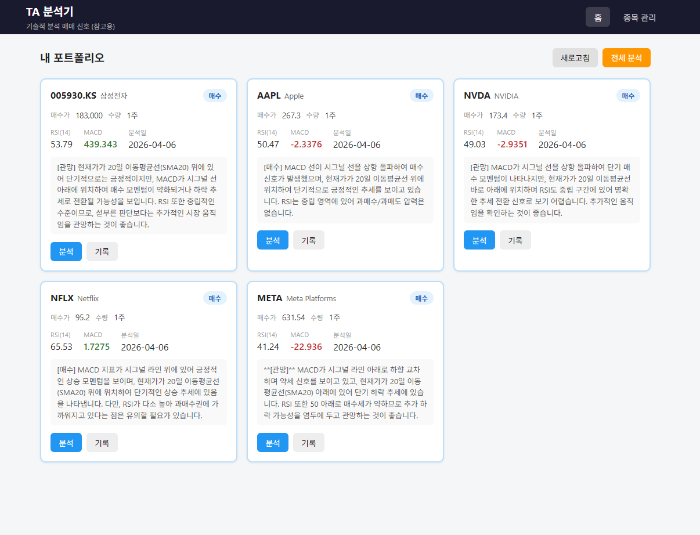

# daily-ta
> For those who can't stop loss

보유 종목 기술적 분석(TA, Technical Analysis) 및 단기 전략 추천

## 기술 스택

### 백엔드
- **프레임워크**: FastAPI (Python)
- **이유**: 비동기 처리, 자동 문서화, 타입 안정성

### 프론트엔드
- **프레임워크**: Vue.js 3
- **기능**: 포트폴리오 관리, TA 결과 시각화

### 데이터 소스
- **주가 데이터**: yfinance
- **기술적 지표**: ta 라이브러리 (RSI, MACD, 이동평균선 등)
- **LLM**: Gemini API

### 데이터베이스
- **SQLite** (로컬 개발용)
- 추후 PostgreSql 등 도입 예정

## Overview
